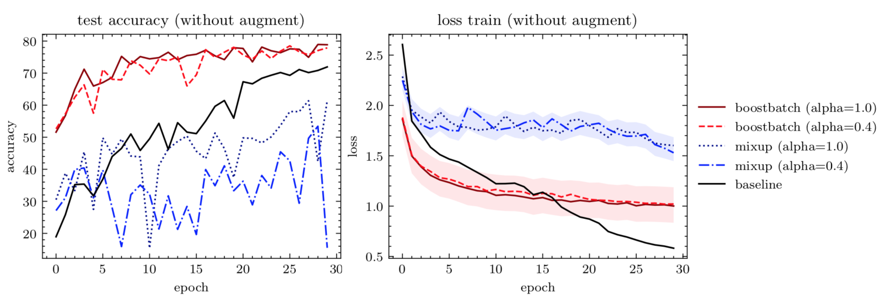

# batchboost
By [Maciej A. Czyzewski](https://github.com/maciejczyzewski)

## Introduction

<b>Overview</b>
<div align="center">
	
</div>

<b>Results</b>
<div>
	
</div>

This repository contains the implementation used for the results in
our paper (?).

## Requirements and Installation
* A computer running macOS or Linux
* For training new models, you'll also need a NVIDIA GPU and [NCCL](https://github.com/NVIDIA/nccl)
* Python version 3.6
* A [PyTorch installation](http://pytorch.org/)

## Training
Use `python train.py` to train a new model.
Here is an example setting:
```bash
$ CUDA_VISIBLE_DEVICES=0 python3 train.py --decay=1e-5 --no-augment --seed=1 \
	--name=batchboost --model=efficientnet-b0 --epoch=30
```

## Using

File `batchboost.py` should be portable, just copy into your path and rewrite
the following:

```diff
+	from batchboost import BatchBoost

+	BB = BatchBoost(num_classes=10, use_cuda=use_cuda)

	...
+		BB.clear() # empty the buffers
		for batch_idx, (new_inputs, new_targets) in enumerate(trainloader):
			if use_cuda:
				new_inputs, new_targets = new_inputs.cuda(), new_targets.cuda()

+			# -----> (a) feed our batchboost
+			if not BB.feed(new_inputs, new_targets):
+				continue

+			outputs = net(BB.inputs)
			# -----> (b) calculate loss with respect of mixup
+			loss = BB.criterion(criterion, outputs)

			train_loss += loss.data
			_, predicted = torch.max(outputs.data, 1)
+			total += BB.inputs.size(0)

+			# -----> (c) custom metric calculaction
+			correct += (
+				BB.lam * predicted.eq(BB.targets_a.data).cpu().sum().float() +
+				(1 - BB.lam) * predicted.eq(BB.targets_b.data).cpu().sum().float())

+			# -----> (d) batch pairing & mixing
+			BB.mixing(criterion, outputs, args.alpha)
	...
```

## License

Implemented as fork of ["mixup-cifar10 / facebook"](https://github.com/facebookresearch/mixup-cifar10).
This project is CC-BY-NC-licensed.
