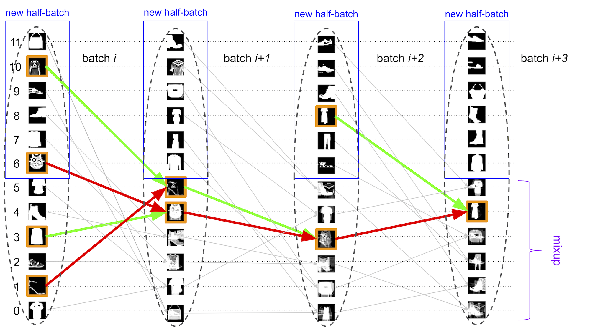

# batchboost (currently a draft)
By [Maciej A. Czyzewski](https://github.com/maciejczyzewski)

This repository contains the implementation used for the results in
our paper (https://arxiv.org/abs/2001.07627).

[](https://paperswithcode.com/sota/image-classification-on-cifar-10?p=batchboost-regularization-for-stabilizing)

---

_Batchboost_ is a simple technique to accelerate ML model training by adaptively feeding mini-batches with artificial samples which are created by mixing two examples from previous step - in favor of pairing those that produce the difficult one.

<div align="center">
	
	
</div>

## Introduction

> **UPDATE 24/01/2020:** Thank you for your e-mails asking about _batchboost_. As promised, I will update the results soon and present comparisons with other solutions (paperswithcode.com). This is a draft and research needs to be continued to be complete work, if someone is interested in helping me, please contact.

### Overview

In this research, we state the hypothesis that mixing many images together can
be more effective than just two.  To make it efficient, we propose a new method of
creating mini-batches, where each sample from dataset is propagated with
subsequent iterations with less and less importance until the end of learning
process.

Batchboost pipeline has three stages:
(a) _pairing_: method of selecting two samples from previous step.
(b) _mixing_: method of creating a new artificial example from two selected samples.
(c) _feeding_: constructing training mini-batch with created examples and new samples from dataset (concat with ratio γ).
Note that sample from dataset propagates with subsequent iterations with less and less importance until the end of training.

<div align="left">
	<a href="https://arxiv.org/abs/2001.07627">
		
	</a>
</div>

### Results

> **COMING:** comparison of _batchboost_ applied: to different architectures, to different problems (small datasets), for training GAN-s, with/without augmentation, with different parameters {window_normal, window_boost, factor} (hyperparameter tuning).

The results will be updated and saved to [`results/`](https://github.com/maciejczyzewski/batchboost/tree/master/results).

<b>Underfitting & Stabilizing Training</b>
<div>
	
</div>

_Figure 1:_ Evaluation on _CIFAR-10_, for _EfficientNet-b0_ and
_SGD(weight-decay=10e-4, lr=0.1)_ (as recommended in the _mixup_ research), same
parameters for each model. As a result, the models behave differently, although
they differ only in the method of constructing the mini-batch.

<b>Overfitting (comparison to mixup)</b>
<div>
	
</div>

_Figure 2:_ _batchboost_ is a new state-of-the-art because it is a slightly better than _mixup_ (here _mixup_ has been tuned for best parameters, _batchboost_ uses configuration from _Figure 1_).

## Requirements and Installation

* A computer running macOS or Linux
* For training new models, you'll also need a NVIDIA GPU and [NCCL](https://github.com/NVIDIA/nccl)
* Python version 3.6
* A [PyTorch installation](http://pytorch.org/)

## Training

Use `python train.py` to train a new model.
Here is an example setting:
```bash
# for batchboost
$ CUDA_VISIBLE_DEVICES=0 python3 train.py --decay=1e-4 --no-augment --seed=1 \
	--name=batchboost --model=efficientnet-b0 --epoch=30
# for mixup
$ CUDA_VISIBLE_DEVICES=0 python3 train.py --decay=1e-4 --no-augment --seed=1 \
	--name=mixup --model=efficientnet-b0 --epoch=30
```

## Using

File [`batchboost.py`](https://github.com/maciejczyzewski/batchboost/tree/master/batchboost.py) should be portable, just copy into your path and write the following:

```python3
from batchboost import BatchBoost

# how to calculate error per sample?
def fn_error(outputs, targets):
    logsoftmax = nn.LogSoftmax(dim=1)
    return torch.sum(-outputs * logsoftmax(targets), dim=1)

# how to represent target in linear form (label -> one-hot)
def fn_linearize(x, num_classes=10):
    _x = torch.zeros(x.size(0), num_classes)
    _x[range(x.size(0)), x] = 1
    return _x

# how to get back (one-hot -> label)
def fn_unlinearize(x):
    _, _x = torch.max(x, 1)
    return _x

BatchBoost.fn_error = fn_error
BatchBoost.fn_linearize = fn_linearize
BatchBoost.fn_unlinearize = fn_unlinearize

#     if you don't want to train everything using `batchboost` method
# epoch: [... -> window_normal -> window_boost -> window_normal -> ...]
#               (  batches    )  (  batches   )  (  batches    )

BB = BatchBoost(
    alpha=args.alpha, # alpha parameter for mixup
    window_normal=0,  # consecutive batch fits: normal
    window_boost=10,  #                       : batchboost
    factor=1 / 2,     # ratio between new information and feeded/mixed
    use_cuda=True,
)

...
```

And slightly change your training loop:

```python3
...

for batch_idx, (new_inputs, new_targets) in enumerate(trainloader):
	if use_cuda:
		new_inputs, new_targets = new_inputs.cuda(), new_targets.cuda()

	# -----> (a) feed with new information
	if not BB.feed(new_inputs, new_targets):
		continue
	
	# -----> (b) apply concat: BB.inputs, BB.targets
	outputs = net(BB.inputs)

	# -----> (c) calculate: loss (mixup like style \lambda)
	loss = BB.criterion(criterion, outputs)

	train_loss += loss.data
	_, predicted = torch.max(outputs.data, 1)
	total += BB.inputs.size(0) # -----> remember to use concat

	# -----> (d) calculate: accuracy
	correct += BB.correct(predicted)

	# -----> (e) pairing & mixing
	BB.mixing(criterion, outputs)

	...
```

## Citation

If you find _batchboost_ useful in your research, please consider citing:

```bibtex
@misc{czyzewski2020batchboost,
    title={batchboost: regularization for stabilizing training with resistance to underfitting & overfitting},
    author={Maciej A. Czyzewski},
    year={2020},
    eprint={2001.07627},
    archivePrefix={arXiv},
    primaryClass={cs.LG}
}
```

_An interesting topic for further research and discussion are
combination of batchboost and existing methods._

## License

Implemented as fork of ["mixup-cifar10 / facebook"](https://github.com/facebookresearch/mixup-cifar10).
This project is CC-BY-NC-licensed.


